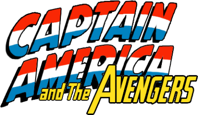

# **Đồ án Nhập môn Phát triển Game - SE102 UIT**

* __Built by: Hei Dun Luv__ -  __`Hate and Love`__ 
  
    * 17520583 - Nguyễn Quang Huy
    * 17520372 - Đào Mạnh Dũng
    * 17520702 - Nguyễn Huỳnh Lợi  
---

  

 Captain America and The Avengers (NES) 

<a href="https://www.youtube.com/watch?v=opvoS4-yUgg">Watch video demo</a>

<a href="https://github.com/loia5tqd001/SE102-UIT-Game-Captain-America-and-The-Avengers/releases">Download executable zip file released</a>

## **Hotkeys**
| Key | Command |
|-----|---------|
| <kbd>Esc</kbd> | __setting keyboard & pause game__ |
| <kbd>Ctrl</kbd> | __toggle debug mode__ | 
| <kbd>Hold Shift</kbd> | __deep debug__ (_if already in debug mode_) |
| <kbd>Alt</kbd> | __scanline effect__ (_if not already in debug mode_) |
| <kbd>Tab</kbd> | __toggle light__ (_in `Pittsburgh`, `Boss Charleston`_) |
| <kbd>Enter</kbd> | __go next map__ |
| <kbd>M</kbd> | __mute/unmute sound__ |
| <kbd>+/-</kbd> | __volume up/volume down__ |
| <kbd>NUMPAD +/-</kbd> | __pump/draw player hp__ |
| <kbd>NUMPAD 0</kbd> | __go to checkpoint 0__ (_`Charleston`_) |
| <kbd>NUMPAD 1</kbd> | __go to checkpoint 1__ (_`Charleston`_) |
| <kbd>NUMPAD 2</kbd> | __go to checkpoint 2__ (_`Boss Charleston`_) |
| <kbd>NUMPAD 3</kbd> | __go to checkpoint 3__ (_`Pittsburgh`_) |
| <kbd>NUMPAD 4</kbd> | __go to checkpoint 4__ (_`Pittsburgh`_) |
| <kbd>NUMPAD 5</kbd> | __go to checkpoint 5__ (_`Pittsburgh`_) |
| <kbd>NUMPAD 6</kbd> | __go to checkpoint 6__ (_`Pittsburgh`_) |
| <kbd>NUMPAD 7</kbd> | __go to checkpoint 7__ (_`Red Alert`_) |

####

## **Controls**
### **Default Key Controls**
| Key Control | Default Keyboard |
|-------------|------------------|
| <kbd>Left</kbd> | <kbd>←</kbd> |
| <kbd>Up</kbd> | <kbd>↑</kbd> | 
| <kbd>Right</kbd> | <kbd>→</kbd> | 
| <kbd>Down</kbd> | <kbd>↓</kbd> | 
| <kbd>Attack</kbd> | <kbd>z</kbd> |
| <kbd>Jump</kbd> | <kbd>x</kbd> |

### **Operations**
| Key Control | Operation |
|------------|-----------|
| <kbd>Left/Right</kbd> | __walk left/right__ (_if is on ground_) |
| <kbd>Left/Right</kbd> | __swim left/right__ (_if is in water_) |
| <kbd>Left/Right</kbd> | __move and face left/right__ (_if is on the air_) |
| <kbd>Quick Double Holding Left/Right</kbd> | __tackle left/right__ |
| <kbd>Up</kbd> | __use shield cover head__ (_if is on ground_) |
| <kbd>Up</kbd> | __enter private room__ (_if is in front of the private door_) |
| <kbd>Down</kbd> | __normal sit__ (_if is on ground_) |
| <kbd>Down</kbd> | __put shield under__ (_if is spinning_) |
| <kbd>Down</kbd> | __dive__ (_if is in water_) |
| <kbd>Down</kbd> | __free fall__ (_if is swinging a bar_) |
| <kbd>Jump</kbd> | __low height jump__ (_if is standing_) |
| <kbd>Jump</kbd> | __fall through__ (_if is sitting on a passable ground_) |
| <kbd>Hold Jump</kbd> | __spin__ (_if already jumped high enough_) |
| <kbd>Attack</kbd> | __throw shield__ (_if is holding shield_) |
| <kbd>Attack</kbd> | __punch__ (_if is not holding shield_) |
| <kbd>Attack</kbd> | __sit-punch__ (_if is sitting_) |
| <kbd>Attack</kbd> | __kick__ (_if is on the air_) |
            
## **Development Environment**
* Visual Studio 2017
* C++17
* DirectX 9

## **References**
* [Castlevania Game Project By NearHuscarl](https://github.com/NearHuscarl/Castlevania)
* [My Framework](https://github.com/loia5tqd001/Game-FrameWork) _(for more references)_   
  
## **Credit**
- Đồ án này tham khảo nhiều ý tưởng từ đồ án game của anh N PMCL2016.2. README này cũng đã __cố tình__ làm giống README của anh N như một lời tri ân. Nếu anh N có đọc được và thấy không hài lòng với việc này, cứ gửi yêu cầu và README này sẽ được gỡ bỏ.
---
*"Mấy anh chị ở đây làm 3 4 tháng mà còn không xong cái game thì mấy bạn học lần đầu làm kiểu gì 4 tuần xong được cái game, rớt chắc rồi. Nếu mình biết trước mình đã khuyên không học rồi. Có học vượt gì đi nữa thì cũng không nên học lần đầu trong học kì hè, học kì nào cũng được nhưng miễn đừng là học kì hè. Thôi coi như đổi tiền lấy kinh nghiệm vậy ..."*
:blush: